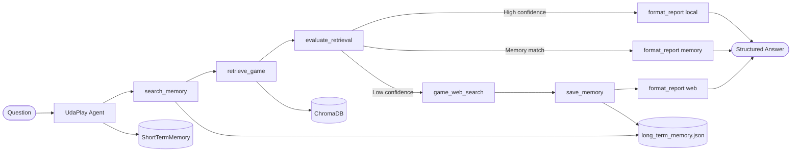

# 🎮 UdaPlay — AI Research Agent for the Video Game Industry


UdaPlay is a **stateful RAG-augmented AI agent** that answers questions about the video game industry. It checks long-term memory first, then searches a local ChromaDB vector database, evaluates retrieval quality with an LLM-as-judge, and falls back to live web search (Tavily) when needed — producing cited, confidence-graded, structured answers.

Built as a Udacity capstone project and refactored into a production-quality Python package.

---

## Architecture



The agent follows a **7-step workflow** for every question:

1. **`search_memory`** — check long-term JSON memory for previous research on this topic
2. **`retrieve_game`** — semantic search over 15 curated game records in ChromaDB
3. **`evaluate_retrieval`** — LLM-as-judge returns `EvaluationReport {confidence, useful, needs_web_search}`
4. **Route:** local RAG sufficient → answer; memory match → reuse; both weak → web search
5. **`game_web_search`** *(if needed)* — Tavily live web search
6. **`save_memory`** *(after web search)* — persist the answer for future sessions
7. **`format_report`** — produce a machine-readable structured JSON output

---

## Long-Term Memory

UdaPlay uses a **JSON-backed persistent memory** (`data/memory/long_term_memory.json`) that survives across sessions.

**Why JSON over SQLite:** zero extra dependencies, human-readable, trivially inspectable by reviewers, and simple keyword search is sufficient for the entry counts this project targets.

Every saved entry looks like:

```json
{
  "question":    "Who developed FIFA 21?",
  "answer":      "FIFA 21 was developed by EA Vancouver...",
  "source_type": "web_search",
  "sources":     ["https://en.wikipedia.org/wiki/FIFA_21"],
  "confidence":  "high",
  "timestamp":   "2026-06-11T14:58:43+00:00",
  "tags":        ["fifa", "ea", "vancouver", "developer", "football"]
}
```

The memory engine:
- **Rejects** empty answers, very short answers, and entries containing API-key-like patterns
- **Auto-generates tags** from question + answer keywords (stop-words excluded)
- **Searches** via keyword overlap scoring — fast, dependency-free, no embedding cost
- **Normalises** comma-separated source strings into lists

---

## Additional Tools

| Tool | Purpose |
|---|---|
| `search_memory` | Search long-term memory before hitting the vector DB or web |
| `save_memory` | Persist useful answers across sessions; validates before writing |
| `summarize_game_profile` | LLM-produced clean game profile from raw RAG results |
| `format_report` | Structured JSON report — makes the agent API-ready |

---

## Example Outputs

### Path 1 — Local RAG (high confidence)

```
Query: When was Pokémon Gold and Silver released?

Tool Trace:
1. search_memory      — no strong match
2. retrieve_game      — 1 result · 006.json · similarity 0.96
3. evaluate_retrieval — confidence: high · needs_web_search: false
4. format_report      — structured output generated

Answer: Pokémon Gold and Silver were released in 1999 for the Game Boy Color.
Source: 💾 Local RAG  |  Confidence: 🟢 high
Citation: 006.json
```

### Path 2 — Memory reuse

```
Query: Who developed FIFA 21?  (asked in a later session)

Tool Trace:
1. search_memory      — match found (from previous web search session)
2. retrieve_game      — weak local match
3. evaluate_retrieval — confidence: low
4. format_report      — source_type: memory

Answer: FIFA 21 was developed by EA Vancouver (recalled from memory).
Source: 🧠 Memory  |  Confidence: 🟢 high
```

### Path 3 — Web fallback + save

```
Query: Who developed FIFA 21?  (first time asking)

Tool Trace:
1. search_memory      — no match
2. retrieve_game      — no FIFA 21 in local database
3. evaluate_retrieval — confidence: low · needs_web_search: true
4. game_web_search    — Tavily returned 3 results
5. save_memory        — answer saved to long_term_memory.json
6. format_report      — structured output generated

Answer: FIFA 21 was developed by EA Vancouver, published by Electronic Arts.
Source: 🌐 Web Search  |  Confidence: 🟢 high
Citations: wikipedia.org/wiki/FIFA_21 · easportsfc.fandom.com
```

---

## Project Structure

```
UdaPlay/
├── src/udaplay/               # Installable Python package (v0.2.0)
│   ├── agents.py              # Agent + StateMachine orchestration
│   ├── tools.py               # make_game_tools() factory — 7 tools
│   ├── long_term_memory.py    # LongTermMemory — JSON-backed persistent store
│   ├── config.py              # Settings dataclass (reads .env)
│   ├── loaders.py             # GameJSONLoader
│   ├── vector_db.py           # ChromaDB wrappers
│   ├── memory.py              # ShortTermMemory (in-session)
│   ├── state_machine.py       # Generic StateMachine[T]
│   └── ...                    # llm, messages, parsers, tooling, rag, documents
│
├── notebooks/
│   ├── 01_rag_pipeline.ipynb       # Build & populate ChromaDB
│   └── 02_agent_demo.ipynb         # Agent queries with all 7 tools + memory
│
├── app/
│   └── streamlit_app.py       # UI with memory viewer, source badges, JSON report
│
├── tests/
│   ├── conftest.py
│   ├── test_memory.py         # ShortTermMemory + LongTermMemory (25+ tests)
│   ├── test_tools.py          # All 7 tools (35+ tests)
│   ├── test_agent_workflow.py # 3 decision paths (15+ tests)
│   ├── test_evaluation.py
│   ├── test_loaders.py
│   ├── test_parsers.py
│   └── test_state_machine.py
│
├── data/
│   ├── games/                 # 15 game JSON files
│   └── memory/                # long_term_memory.json (auto-created, git-ignored)
│
├── docs/architecture.md
├── outputs/sample_agent_runs.md
├── pyproject.toml
├── requirements.txt
└── requirements-dev.txt
```

---

## Quick Start

### 1. Clone and install

```bash
git clone <your-repo-url>
cd UdaPlay
pip install -e ".[dev]"
```

### 2. Configure API keys

```bash
cp .env.example .env
# edit .env:
# OPENAI_API_KEY=sk-...
# TAVILY_API_KEY=tvly-...
```

### 3. Build the vector database

Run `notebooks/01_rag_pipeline.ipynb` — embeds 15 game JSON files into ChromaDB.

### 4. Run the agent demo

Run `notebooks/02_agent_demo.ipynb` for interactive queries with full tool traces.

### 5. Launch the Streamlit UI

```bash
streamlit run app/streamlit_app.py
```

The UI shows: answer, confidence badge, source type (Local RAG / Memory / Web Search), tool trace, structured JSON report, and a memory viewer.

---

## Running Tests

Tests are fully mocked — **no API keys required**.

```bash
# Run all unit tests
pytest -m "not integration" -q

# Run with verbose output
pytest -m "not integration" -v

# Run with coverage
pytest -m "not integration" --cov=udaplay --cov-report=term-missing

# Run a specific test module
pytest tests/test_memory.py -v
pytest tests/test_tools.py -v
pytest tests/test_agent_workflow.py -v
```

Test coverage:

| File | What it tests |
|---|---|
| `test_memory.py` | `ShortTermMemory` (sessions, isolation) + `LongTermMemory` (save, reject, search, persist) |
| `test_tools.py` | All 7 agent tools — retrieve, evaluate, web search, search_memory, save_memory, summarize, format_report |
| `test_agent_workflow.py` | 3 full decision paths (local RAG, memory fallback, web fallback) + session isolation |
| `test_evaluation.py` | `EvaluationReport` model validation and JSON contract |
| `test_loaders.py` | `GameJSONLoader`, `format_game_document`, `build_metadata` |
| `test_parsers.py` | Output parsers (str, JSON, Pydantic) |
| `test_state_machine.py` | `StateMachine`, `Step`, conditional routing, resource injection |

---

## Tech Stack

| Component | Technology |
|---|---|
| LLM | OpenAI `gpt-4o-mini` |
| Embeddings | OpenAI `text-embedding-ada-002` |
| Vector database | ChromaDB (persistent, cosine similarity) |
| Long-term memory | JSON file (`data/memory/long_term_memory.json`) |
| Web search | Tavily API |
| Agent orchestration | Custom `StateMachine[T]` + `Agent` |
| UI | Streamlit |
| Testing | pytest + unittest.mock (no API keys needed) |
| Package management | pyproject.toml + pip install -e . |


---

## Architecture Deep Dive

See [`docs/architecture.md`](docs/architecture.md) for component reference, Mermaid sequence diagrams, and data model documentation.
