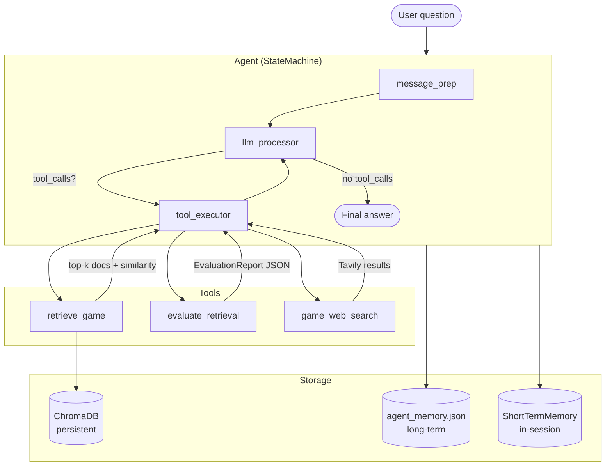
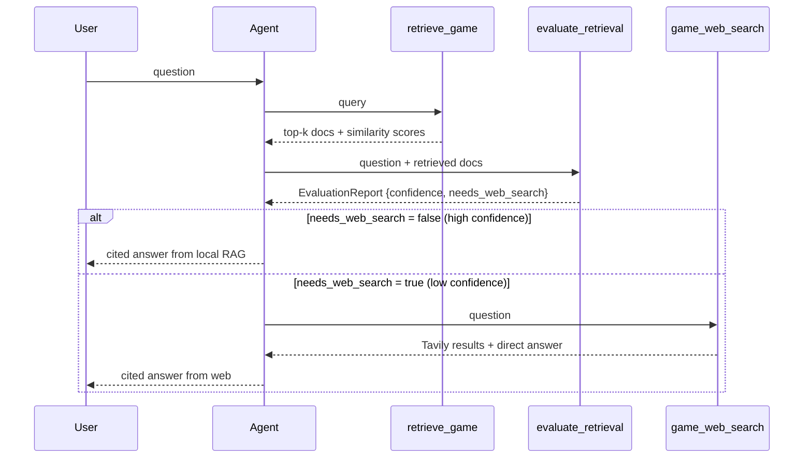

# UdaPlay — Architecture

## Overview

UdaPlay is a stateful RAG-augmented agent that answers questions about the video game industry. It combines a local vector database of curated game records with live web search, routing between them based on an LLM-as-judge evaluation step.

## System Diagram



## Decision Flow



## Component Reference

### `src/udaplay/`

| Module | Role |
|---|---|
| `config.py` | `Settings` dataclass; reads env vars, computes absolute paths |
| `agents.py` | `Agent` class — wraps `StateMachine`, manages tools, session memory |
| `state_machine.py` | Generic `StateMachine[T]` — `EntryPoint`, `Step`, `Termination`, `Run`, `Snapshot` |
| `tools.py` | `make_game_tools()` factory — returns `retrieve_game`, `evaluate_retrieval`, `game_web_search` closures |
| `loaders.py` | `GameJSONLoader`, `format_game_document()`, `build_metadata()` |
| `vector_db.py` | `VectorStore`, `VectorStoreManager` — ChromaDB wrappers |
| `memory.py` | `ShortTermMemory` (in-session) + long-term JSON persistence |
| `llm.py` | `LLM` — thin OpenAI chat wrapper |
| `tooling.py` | `Tool` class — function introspection, JSON schema generation |
| `messages.py` | `UserMessage`, `AIMessage`, `SystemMessage`, `ToolMessage` |
| `parsers.py` | `StrOutputParser`, `JsonOutputParser`, `PydanticOutputParser` |
| `evaluation.py` | LLM-as-judge helpers |
| `rag.py` | `RAGPipeline` — combines loader + vector store |
| `documents.py` | `Document`, `Corpus` value objects |

### Key Data Models

**`EvaluationReport`** (Pydantic):
```python
class EvaluationReport(BaseModel):
    confidence: str      # "high" | "medium" | "low"
    useful: bool
    description: str
    needs_web_search: bool
```

**`Settings`** (dataclass):
```python
@dataclass
class Settings:
    openai_api_key: str
    tavily_api_key: str
    chroma_path: str           # default: <project_root>/chromadb
    collection_name: str       # default: "udaplay_games"
    embedding_model: str       # default: "text-embedding-ada-002"
    llm_model: str             # default: "gpt-4o-mini"
    n_retrieval_results: int   # default: 3
    memory_file: str           # default: <project_root>/agent_memory.json
```

## Vector Database

- **Client:** `chromadb.PersistentClient` (on-disk, cosine similarity)
- **Embedding:** OpenAI `text-embedding-ada-002`
- **Document format:** `"Game: {name}. Platform: {platform}. Genre: {genre}. Publisher: {publisher}. Released: {year}. Description: {desc}"`
- **Metadata fields:** `title`, `platform`, `genre`, `publisher`, `release_year`, `source_file`
- **Collection:** `udaplay_games` (15 documents, classic titles)

## Memory Architecture

| Layer | Implementation | Scope | Persistence |
|---|---|---|---|
| Short-term | `ShortTermMemory` (dict of lists) | Per session | In-process only |
| Long-term | `agent_memory.json` (append-only JSON) | Cross-session | On-disk |

## Project Layout

```
UdaPlay/
├── src/udaplay/         # Installable Python package
├── lib/                 # Original lib (Udacity compatibility — do not edit)
├── notebooks/           # Portfolio notebooks (use udaplay package)
│   ├── 01_rag_pipeline.ipynb
│   └── 02_agent_demo.ipynb
├── Udaplay_01_solution_project.ipynb  # Udacity submission
├── Udaplay_02_solution_project.ipynb  # Udacity submission
├── app/
│   └── streamlit_app.py
├── data/games/          # 15 game JSON files
├── tests/               # pytest suite (mocked, no API keys needed)
├── docs/
│   └── architecture.md
├── outputs/
│   └── sample_agent_runs.md
├── chromadb/            # ChromaDB on-disk store (git-ignored)
├── agent_memory.json    # Long-term memory (git-ignored)
├── pyproject.toml
├── requirements.txt
├── requirements-dev.txt
└── .env                 # API keys (git-ignored)
```

## Running Locally

```bash
# 1. Install
pip install -e ".[dev]"

# 2. Set keys
cp .env.example .env
# edit .env with OPENAI_API_KEY and TAVILY_API_KEY

# 3. Build vector database
jupyter notebook notebooks/01_rag_pipeline.ipynb

# 4. Run agent demo
jupyter notebook notebooks/02_agent_demo.ipynb

# 5. Streamlit UI
streamlit run app/streamlit_app.py

# 6. Tests (no API keys needed)
pytest -m "not integration"
```
